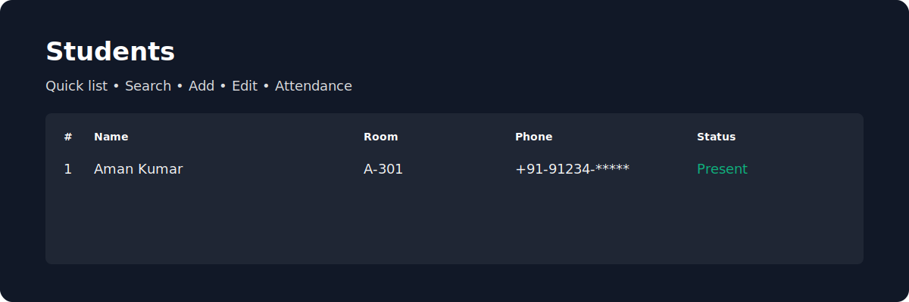

# Hostel Management System 🏨


An attractive, easy-to-use **Hostel Management System** built with the MERN stack (MongoDB, Express, React, Node) and Redux for state management. This project helps manage students, attendance, and users with a clean UI and a simple API.

---

## ✨ Highlights

- Modern React frontend with Redux for predictable state management
- RESTful API with Express and MongoDB (Mongoose)
- JWT authentication and role-based access controls (admin/user)
- Seed script to populate demo data quickly
- Ready for deployment (Heroku/Render/Netlify)

---

## 🚀 Quick Start

1. Install dependencies for backend and frontend:

```bash
# root (optional if you prefer separately)
npm install

# Backend
cd server && npm install

# Frontend
cd ../frontend && npm install
```

2. Create a `.env` in `server/` with the following values (example):

```
NODE_ENV=development
PORT=5000
MONGO_URI=your_mongodb_uri
JWT_SECRET=your_jwt_secret
```

3. Run the server and frontend (run in separate terminals):

```bash
# Backend
cd server
npm run dev

# Frontend
cd frontend
npm start
```

4. Open http://localhost:3000 and explore!

---

## 📷 Demo Screenshots

**Dashboard / Home**


**Students & Attendance**



> Tip: Replace the placeholder SVGs in `assets/` with real PNG/JPG screenshots for a more polished README.

---

## ✅ Features

- Register / Login (JWT)
- Add / Edit / Delete students
- Mark attendance & view attendance history
- Analytics & simple charts for insights
- Admin-only data controls

---

## 🛠 Useful scripts

- `npm run dev` (in `server`) — start dev server with nodemon
- `npm start` (in `frontend`) — start React dev server
- `node server/seeder.js` — seed the database with sample users/students (check the seeder script)

---

## 🤝 Contributing

Contributions are welcome! Please open an issue first for major changes, then submit a PR with tests and documentation updates.

---

## 📄 License

MIT — feel free to use, modify, and distribute.

---

Made with ❤️ by ashwanisingh51 — if you'd like, I can replace the demo SVGs with screenshots of your running app next.
